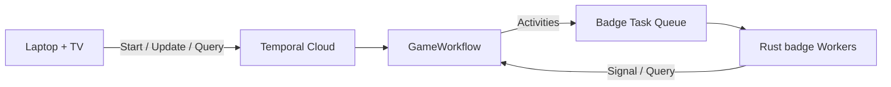

# Durable Trivia

A 60-second competitive trivia game where Temporal Replay 2026 badges race to
complete real Rust [Temporal](https://temporal.io) Activities. The badges are
Workers, the questions are Activities, and the game survives when a player
deliberately crashes one.

A Rust/Axum controller runs the Workflow Worker and a 16:9 scoreboard on a
laptop. Temporal Cloud coordinates questions, retries unfinished work, and
preserves the round through Worker failures. Physical badges and simulated
badges compete in the same Workflow.

## Temporal Concepts Demonstrated

| Concept | What It Does Here | Where to Look |
|---|---|---|
| **Workflow** | One `GameWorkflow` owns the timer, question deck, scores, power-ups, and result | [`web/src/workflow.rs`](web/src/workflow.rs) |
| **Activities** | Every question is a real `trivia.answer_question` Activity completed by a badge | [`firmware/src/main.rs`](firmware/src/main.rs) |
| **Heartbeats and Retries** | A simulated crash stops heartbeats so Temporal gives unfinished work to another Worker | [`firmware/src/main.rs`](firmware/src/main.rs) |
| **Queries** | The scoreboard and the badges read live state without changing Workflow history | [`web/src/workflow.rs`](web/src/workflow.rs) |
| **Updates** | Operator power-ups durably change the running Workflow | [`web/src/workflow.rs`](web/src/workflow.rs) |
| **Visibility and Memo** | Completed rounds remain discoverable without a game-state database | [`web/src/main.rs`](web/src/main.rs) |

## Architecture



The Workflow is the game state. Each badge owns at most one outstanding
Activity, and a heartbeat timeout returns that work to the queue. The laptop
can restart and reconstruct the board from Temporal history without a separate
game-state database.

## Shared Temporal configuration

Every component — the controller, the simulators and the badge firmware —
reads one dotenv file at the repository root. Copy the example and fill in
your Temporal Cloud namespace and API key:

```sh
cp .env.temporal.example .env
```

```dotenv
TEMPORAL_ADDRESS=your-namespace.tmprl.cloud:7233
TEMPORAL_NAMESPACE=your-namespace.your-account
TEMPORAL_API_KEY=your-api-key
```

`.env` is ignored by Git. Set `TEMPORAL_ENV_FILE` to read the file from
somewhere else; an explicit path must exist. The controller and simulators also
accept a `temporal.toml` profile and `TEMPORAL_*` environment variables, in the
SDK's documented precedence order.

## Quick Start

You need Rust, macOS or Linux, and a Temporal Cloud namespace with an API key.
Badge hardware is optional for the simulated path.

1. Complete the [shared Temporal configuration](#shared-temporal-configuration)
   above.

2. Start the TV controller:

   ```sh
   ./run-web.sh
   ```

3. Start ten simulated badge Workers in a second terminal:

   ```sh
   ./simulate-badges.sh 10
   ```

Open **http://127.0.0.1:3000**, mirror it to the TV, and select **Start Round**.

To use physical hardware, continue with the
[badge firmware guide](firmware/README.md).

## Common checks

Run the host-side checks -- fmt, clippy and the full test suite for `web`,
`shared`, `badge-screen` and `badge-input` -- from the repository root:

```sh
./check-host.sh
git diff --check
```

**Use the script rather than a bare `cargo test`.** `.cargo/config.toml` pins
`build.target` to `xtensa-esp32s3-espidf` so the firmware builds without extra
flags, which means a plain `cargo test` or `cargo clippy` from the root tries
to build the host crates for the badge and fails. `check-host.sh` supplies the
host target and the stable toolchain explicitly. Extra arguments are passed
through to `cargo test`, so `./check-host.sh winner` filters as usual.

Firmware build and hardware verification live in `./build-firmware.sh`.
Component-specific commands are in the [firmware guide](firmware/README.md)
and [web guide](web/README.md).

## Documentation

| Guide | Covers |
|---|---|
| [Contributor guide](AGENTS.md) | Runtime boundaries, required commands, and the rules that have already cost us a round |
| [Badge firmware](firmware/README.md) | ESP Rust toolchain, Wi-Fi, build, flash, controls, sleep, haptics, and physical verification |
| [Web controller](web/README.md) | TV setup, running a round, operator controls, Worker recovery, tests, and Temporal Visibility |
| [Game specification](GAME_SPEC.md) | Scoring, scheduling, retries, power-ups, UI states, and accepted design decisions |
| [Engineering journal](blog.md) | Chronological implementation notes, failures, validation, and unresolved work |

## Project Layout

- `firmware/` — Rust/ESP-IDF Activity Worker for the Replay 2026 badge.
- `web/` — Rust Workflow Worker, Axum controller, TV UI, and the badge
  simulator.
- `shared/` — serialized game contract shared by every Worker.
- `badge-screen/` — hardware-independent 128×64 badge screen renderer and
  previews.
- `badge-input/` — hardware-independent button gesture state machine.

Both the controller and firmware use Temporal Rust SDK `0.7.0`. See the
component guides for build and test commands.
